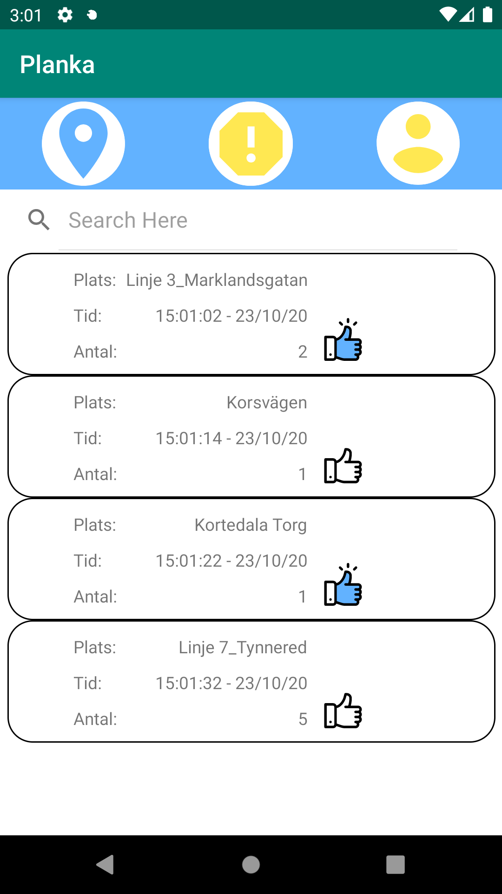
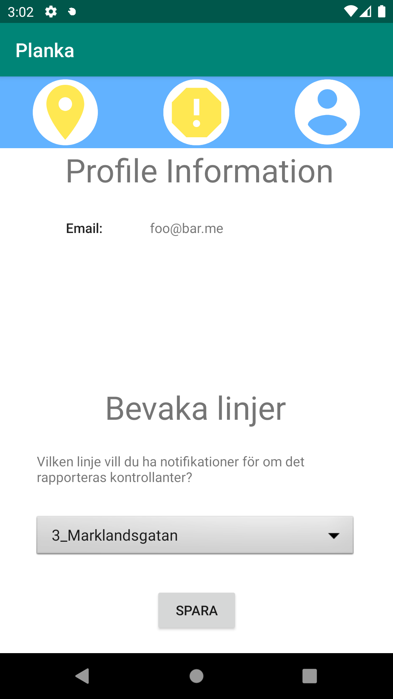

## Planka (OOPP-HT20)
This project is an app keeping track of user interaction with public transport ticket controllants. When you see a controllant you can report it in the app, 
after which other users can interact with your report. This can be done by either vouching for or against the credibility of the report.

## Screenshots
 |
 |

## Tech/framework used

  

## Installation
1. Navigate to where you want to clone the repo.
2. `git clone https://github.com/DKWA0000/OOPP-HT20 `
3. Remember the path!

## How to use?
1. Run your IDE of choice (IntelliJ for example)
2. Import the project and choose Android as SDK
3. Download and choose virtual device to run the application on
4. Build and let the IDE do its magic
5. Run it!

## Tests
1. Edit configuration
2. Create new Android JUnit config
3. Test kind should be all in the directory
3. Select the test folder as the directory
4. Use Planka.app as the classpath of module
5. Run it

With our tests we have covered 100% of the methods and 95% of the lines in our Model package.

## Links
Trello: https://trello.com/b/qLDXbmwg/oopp-ht20 
UML: https://app.diagrams.net/?libs=general;uml#G1BxzyogLWIf1cVpJehRHwTDs7EcTCEe-e 
Google Drive/Documentation: https://drive.google.com/drive/folders/1-A6BRghxyV51emiAgr_YZdRELg8qk5Iy 
Meetings: Fridays 14.00 at https://meet.google.com/xih-hgfv-xoj  
GitHub Repo: https://github.com/DKWA0000/OOPP-HT20
